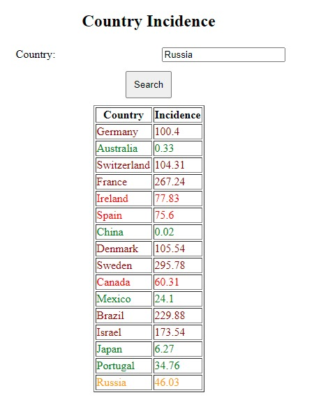
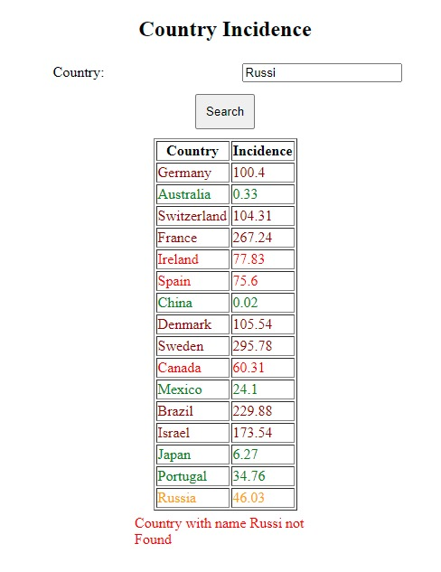

# CovidTravelChecker

In our bid to do our part, we've expanded a free public API for others to build apps upon. The API returns live 7-day-incidence for preselected countries.

<h2>What the API does
</h2>

 The API compares a list of selected countries regarding their current Covid-situation based on
<a href="https://github.com/M-Media-Group/Covid-19-API">Covid-19-API</a> and orders them ascending by their 7-day-incidence. 
The coutries also receive a color-rating based on their current incidence:
<ul>
<li style= "color: #008000;">green - 35</li>
<li style= "color: #ffa500;">orange- 35-50</li>
<li style= "color: red;">red - 50-100</li>
<li style= "color: darkred;">darkred - 100+</li>
</ul>

<h2>API-Request

<h2>JSON-Request: Example</h2>
<pre><code class = "lang-JSON">{
  "countries": [Germany, Franc, Australia] 
}
</code></pre>

<h3>JSON-Response Example</h3>

<pre><code class="lang-JSON">{
  "All": [{
        {
        "country": Germany,
        "incidence": 87.2,
        }
        {
        "country": Franc,
        "incidence": Not found. Make sure the country is spelled correctly (English),
        }
        {
        "country": Australia,
        "incidence": 0.31,
        };
      ]}
  }

  </code></pre>

<h2>Frontend Use</h2>

We've created an example frontend to show how data could be used in an economic environment. Here you can enter a country and it will be shown in a table including its incidence as well as its colorrating.

